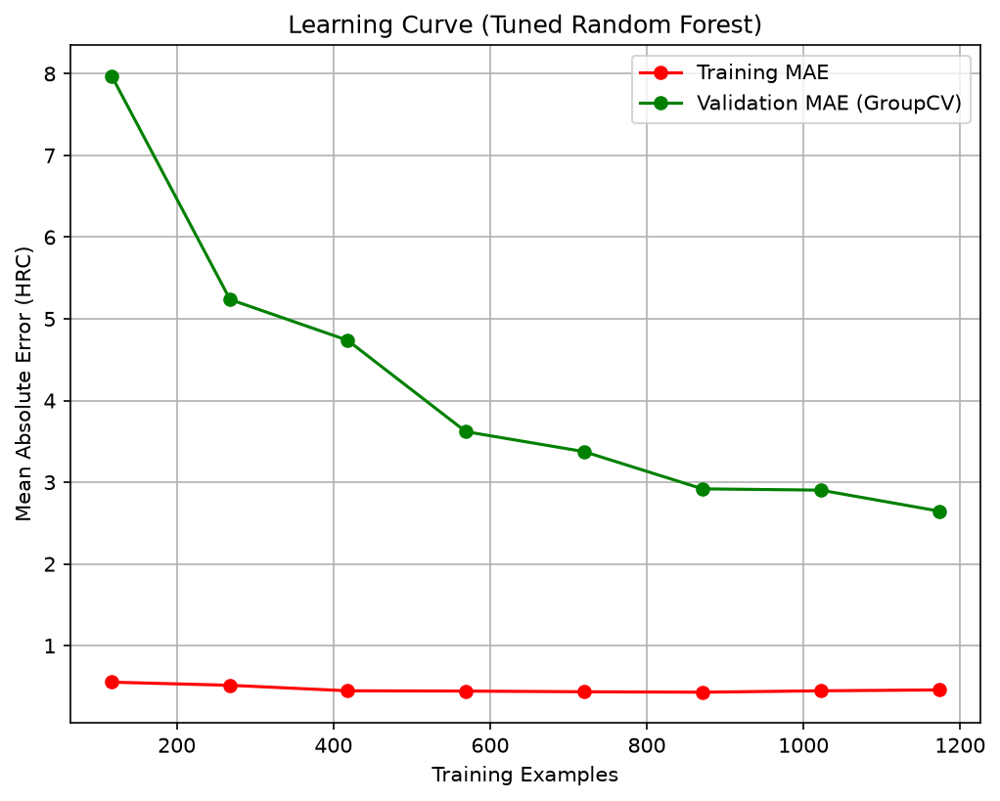

# Materials Data Lab — Phase V2-C1: Hyperparameter Tuning

## Yöntem Özeti
- **D-09**: RandomizedSearchCV, n_iter=40, cv=GroupKFold(5, steel_type). Arama uzayı sınırlandırılmıştır.
- **D-10**: Şampiyon model, S2 GroupKFold MAE metriğine göre seçilmiştir.

## Search Sonuçları
- **Süre**: 40.7 saniye
- **En İyi Parametreler**: `{'n_estimators': 800, 'min_samples_split': 2, 'min_samples_leaf': 1, 'max_features': 0.5, 'max_depth': 30}`
- **CV MAE (best)**: 2.6388

### Top 5 Kombinasyon
| Rank | Parametreler | Test MAE (mean ± std) |
| :--- | :--- | :--- |
| 1 | `{'n_estimators': 800, 'min_samples_split': 2, 'min_samples_leaf': 1, 'max_features': 0.5, 'max_depth': 30}` | 2.6388 ± 0.2449 |
| 2 | `{'n_estimators': 500, 'min_samples_split': 2, 'min_samples_leaf': 1, 'max_features': None, 'max_depth': None}` | 2.6864 ± 0.4025 |
| 3 | `{'n_estimators': 300, 'min_samples_split': 2, 'min_samples_leaf': 1, 'max_features': 0.5, 'max_depth': 10}` | 2.6886 ± 0.2242 |
| 4 | `{'n_estimators': 800, 'min_samples_split': 2, 'min_samples_leaf': 1, 'max_features': None, 'max_depth': 10}` | 2.7019 ± 0.4135 |
| 5 | `{'n_estimators': 300, 'min_samples_split': 2, 'min_samples_leaf': 2, 'max_features': None, 'max_depth': None}` | 2.7076 ± 0.3960 |

## Performans Kıyası (Default vs Tuned)
| Protokol | Model | MAE | RMSE | R² |
| :--- | :--- | :--- | :--- |
| S1 (RandomSplit) | Default RF | 1.5153 | 2.3470 | 0.9737 |
| S1 (RandomSplit) | Tuned RF   | 1.5301 | 2.4826 | 0.9705 |
| | | | | |
| S2 (GroupSplit)  | Default RF | 2.6872 ± 0.3886 | 3.5735 ± 0.5561 | 0.9292 ± 0.0280 |
| S2 (GroupSplit)  | Tuned RF   | 2.6388 ± 0.2449 | 3.4140 ± 0.2786 | 0.9376 ± 0.0148 |

## Öğrenme Eğrisi Gözlemi (Learning Curve)

Eğri, train ve validation MAE arasındaki kapanmayı ve verinin artışıyla kazanımın doygunluğa ulaşıp ulaşmadığını gösterir.