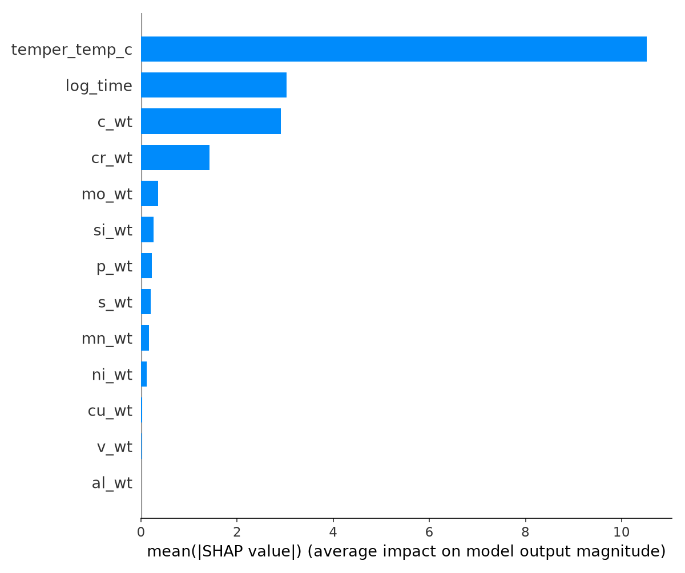
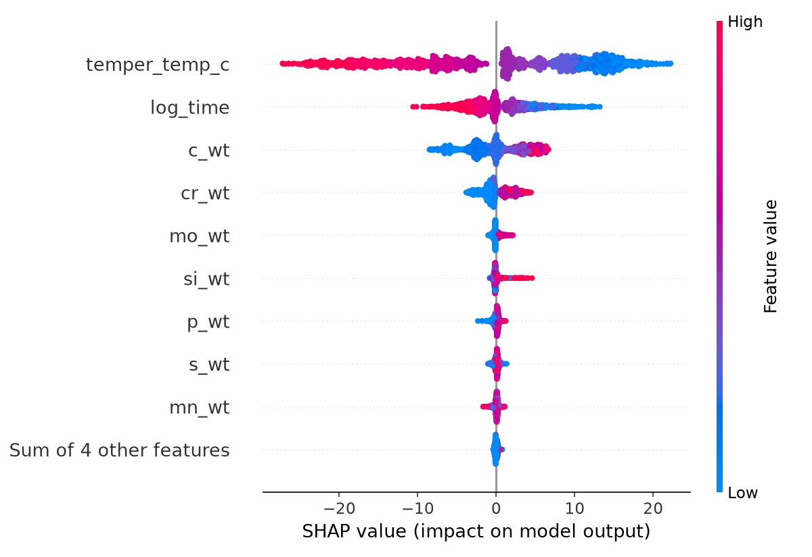
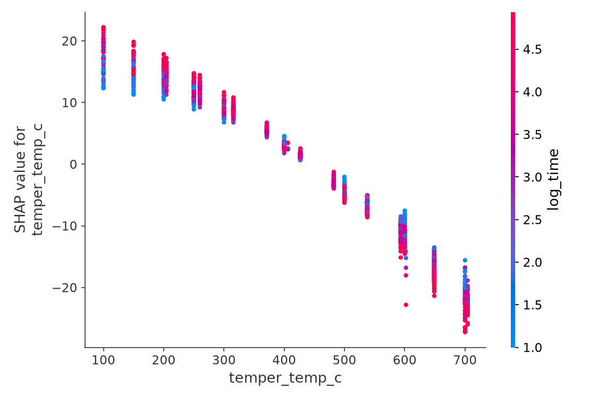

# Materials Data Lab — Phase V2-C2: XGBoost Challenger & SHAP

## Yöntem (D-11 & D-12)
- **D-11**: XGBoost için GroupKFold tabanlı adil yarış. Arama: RandomizedSearchCV, n_iter=30.
- **D-12**: Şampiyon model değişimi için S2 MAE'de >0.15 HRC iyileşme aranır. Yoksa RF tacını korur.

### XGBoost Tuning Sonucu
- Süre: 17.5 saniye
- En İyi Parametreler: `{'subsample': 0.7, 'reg_lambda': 1, 'n_estimators': 800, 'max_depth': 7, 'learning_rate': 0.03, 'colsample_bytree': 1.0}`

## Kıyas Matrisi
| Model | S1 (RandomSplit) MAE | S1 RMSE | S1 R² | S2 (GroupSplit) MAE | S2 RMSE | S2 R² |
| :--- | :--- | :--- | :--- | :--- | :--- | :--- |
| **RF_default** | 1.5153 | 2.3470 | 0.9737 | 2.6872 ± 0.3886 | 3.5735 ± 0.5561 | 0.9292 ± 0.0280 |
| **RF_tuned** | 1.5301 | 2.4826 | 0.9705 | 2.6388 ± 0.2449 | 3.4140 ± 0.2786 | 0.9376 ± 0.0148 |
| **XGB_default** | 1.1972 | 2.1039 | 0.9788 | 2.5024 ± 0.3274 | 3.4129 ± 0.5465 | 0.9370 ± 0.0179 |
| **XGB_tuned** | 1.0516 | 1.8869 | 0.9830 | 2.3498 ± 0.3879 | 3.2054 ± 0.6647 | 0.9439 ± 0.0196 |

## D-12 Kararı (Şampiyon)
> **XGBoost outperforms RF by 0.2890 HRC MAE, which exceeds the 0.15 threshold. XGBoost is the new champion.**

*(Not: Demo V2-F aşamasına kadar default RF modeliyle çalışmaya devam edecektir.)*

## SHAP Yorumlaması (Şampiyon Üzerinde)
Aşağıdaki figürler, şampiyon modelin kararlarını SHAP aracılığıyla görselleştirir.

### 1. Summary Bar

Genel özellik önemini (ortalama mutlak SHAP) verir. Permutation/MDI ile korele olup olmadığına dikkat edilir.

### 2. Beeswarm

Hangi özelliğin yüksek veya düşük değerlerinin tahmini ne yönde değiştirdiğini (korelasyon) gösterir.

### 3. Dependence Plot (Temperature)

Sıcaklığın (temper_temp_c) tahmine olan lineer olmayan etkisini gösterir.

**[REPORT_ONLY] Uyarı**: Ağaç tabanlı modellerde SHAP değerleri korele özellikler arasında dağılabilir, bu da nedensel bir yorumlamayı yanıltıcı kılabilir.